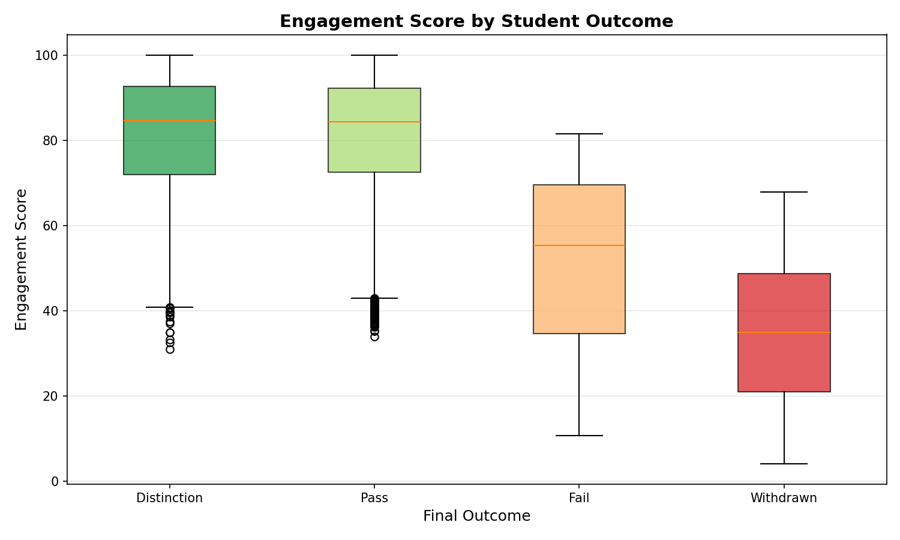
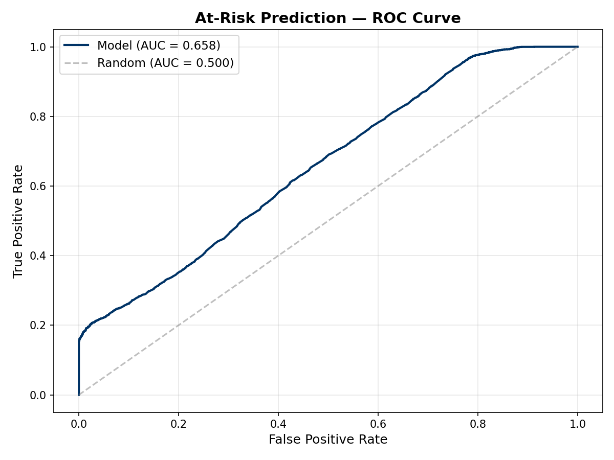
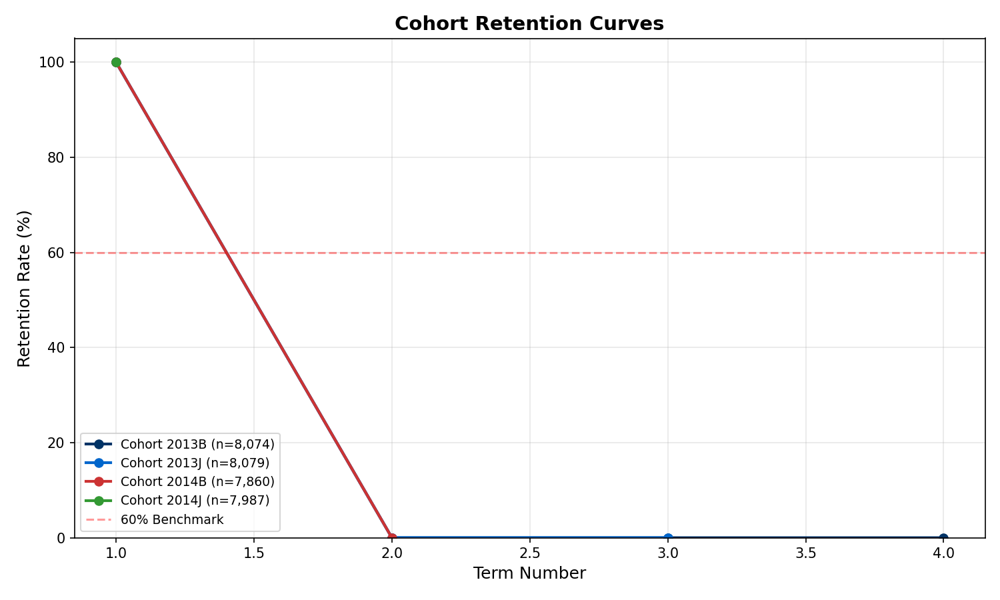

# Student Success Analytics Platform

## Overview

In this project, I built an end-to-end analytics platform to study student engagement, retention, and academic risk. I created a complete workflow that starts with raw student learning data and ends with analytics, machine learning, and business insights.

The project follows this flow:

**Raw Data → ETL Pipeline → Data Warehouse → Analytics → Feature Engineering → Machine Learning Model → Insights**

## What I Built

I created synthetic student data based on the OULAD structure, including enrollment, assessments, registration, and LMS activity. I then built an ETL pipeline to extract, clean, transform, and load the data into a structured SQLite warehouse.

I designed the warehouse using these main tables:

- `dim_student`
- `fact_enrollment`
- `fact_weekly_engagement`
- `fact_retention`

On top of that, I built analysis modules for cohort retention, engagement scoring, and DFW analysis. I also built a logistic regression model to predict at-risk students using engineered features from the analytics layer.

## Key Results

This project helped show that student engagement is strongly related to academic outcomes. Students in the **AT-RISK** group had much lower pass rates than students in the **ON-TRACK** group. The project also showed that early student behavior can be used to identify risk patterns and support early intervention.

## Tech Stack

- Python
- Pandas
- NumPy
- Scikit-learn
- SQLite
- Matplotlib
- Seaborn


## Sample Results

### Engagement Score vs Student Outcome


### At-Risk Model ROC Curve


### Retention Trends



## Project Structure

```text
student-success-analytics/
├── etl/
├── analysis/
├── sql/
├── dashboards/
├── data/
├── docs/
└── README


